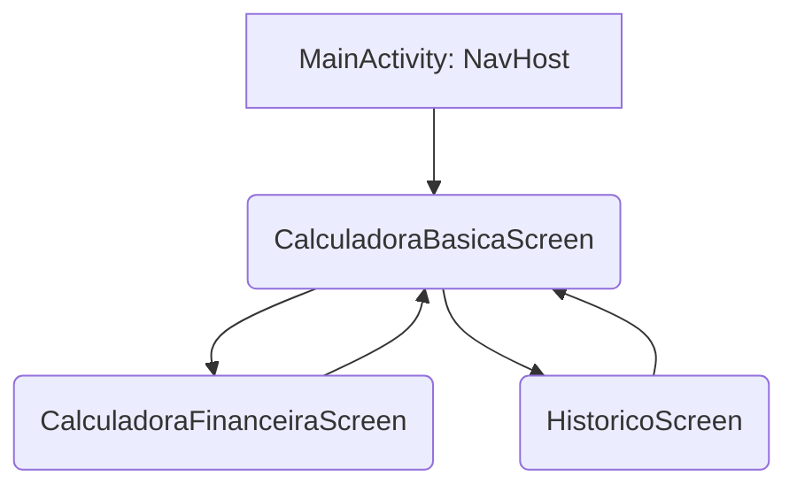

Aqui está a documentação completa, estruturada no formato Markdown, pronta para ser salva como um arquivo **`README.md`** na raiz do seu projeto.

-----

# Calculadora Financeira

## Visão Geral do Projeto

Este projeto consiste em uma aplicação móvel desenvolvida para realizar operações de cálculo e gerenciar o histórico dessas operações de forma persistente. O sistema é composto por um aplicativo **Android nativo** (Frontend) e uma **API simples em Python** (Backend) para a consulta inicial e persistência de dados.

### Funcionalidades Principais

* **Cálculos Básicos:** Execução de operações fundamentais de adição, subtração, multiplicação e divisão.
* **Cálculos Financeiros:** (Funcionalidade a ser implementada ou em desenvolvimento).
* **Histórico Persistente:** Salva as operações realizadas em um banco de dados local (**Room**).
* **Visualização de Histórico:** Consulta as operações salvas no banco de dados local e remoto (simulação).
* **Navegação Dinâmica:** Troca fácil entre as telas de calculadora (**Básica** e **Financeira**).

### Tecnologias Utilizadas

| Componente | Tecnologia | Propósito |
| :--- | :--- | :--- |
| **Frontend** | Kotlin / Android | Linguagem principal e plataforma de desenvolvimento. |
| **Interface** | Jetpack Compose | Framework moderno para construção da interface de usuário. |
| **Navegação** | Jetpack Navigation | Gerencia a troca de telas entre os *composables*. |
| **Persistência Local** | Room Database (com KSP) | Biblioteca de abstração SQLite para armazenamento local do histórico. |
| **Gerenciamento de Estado** | Android ViewModel | Gerencia a lógica de negócios e o estado reativo das telas. |
| **API/Rede** | Retrofit / GSON | Cliente HTTP para comunicação e serialização com o backend Flask. |
| **Backend** | Python / Flask | API leve para simulação de dados de histórico. |
| **BD Backend** | Flask-SQLAlchemy | ORM para gerenciamento do banco de dados SQLite do servidor. |

-----

## Instruções de Execução

Siga os passos abaixo para configurar e rodar o projeto localmente.

### 1. Configuração do Backend (API Flask)

1.  **Pré-requisitos:** Certifique-se de ter **Python 3.x** e **pip** instalados.
2.  **Instalar Dependências:** Navegue até o diretório onde está o arquivo `main.py` e execute:
    ```bash
    pip install Flask Flask-SQLAlchemy
    ```
3.  **Executar o Servidor:** Inicie a API. O servidor criará o arquivo `calculadora.db` se ele não existir e o populará com dados de exemplo na primeira consulta.
    ```bash
    python main.py
    ```
    O servidor iniciará na porta padrão: `http://127.0.0.1:5000/`.

### 2. Configuração do Frontend (App Android)

1.  **URL Base da API (Emulador):** O aplicativo está configurado para se conectar à URL especial do Android Emulator, que mapeia para o seu *host* (sua máquina):
    ```
    URL Base: http://10.0.2.2:5000/
    ```
    * **⚠️ Para Dispositivo Físico:** Se for rodar em um celular de verdade, você deve alterar a URL de conexão do Retrofit para o **IP da sua máquina** na rede local (ex: `http://192.168.1.XX:5000/`).
2.  **Android Studio:** Abra o projeto no Android Studio.
3.  **Execução:** Sincronize o Gradle e execute o aplicativo em um Emulador Android ou dispositivo físico.

-----

## API Endpoints

A API é construída com Flask e possui um único endpoint principal para a consulta de histórico de operações.

| Método | Endpoint | Descrição | Dados de Resposta (JSON) |
| :--- | :--- | :--- | :--- |
| **GET** | `/basicos` | **Busca o histórico** de todas as operações salvas no banco de dados do servidor. Popula o banco com 4 exemplos na primeira execução se estiver vazio. | `[{ "id": 1, "formula": "1+1", "resultado": 2.0 }, ...]` |
| **GET** | `/` | Retorna uma mensagem de *status* simples da API. | `{"api": "API da calculadora"}` |

-----

## Diagrama de Navegação

O fluxo de navegação é gerenciado pelo **Jetpack Navigation** dentro da `MainActivity`, permitindo a troca fluida entre as diferentes telas do aplicativo.

### Telas (Activities/Composables)

1.  **`MainActivity`:** Contém o host principal da navegação.
2.  **`CalculadoraBasicaScreen`:** Tela principal para cálculos elementares.
3.  **`CalculadoraFinanceiraScreen`:** Tela para funcionalidades financeiras.
4.  **`HistoricoScreen`:** Tela para visualizar o histórico de operações.

<!-- end list -->



-----

## Estrutura do Banco de Dados

### 5.1. Banco de Dados Local (Room Database)

O histórico de operações é armazenado no dispositivo para persistência, mesmo sem conexão com o backend.

| Entidade/Tabela | Propósito |
| :--- | :--- |
| **`Historico`** (Exemplo) | Armazena cada operação de cálculo realizada pelo usuário. |

| Coluna | Tipo | Chave | Descrição |
| :--- | :--- | :--- | :--- |
| **id** | Integer | PRIMARY KEY | Identificador único da operação. |
| **formula** | String | | A expressão de cálculo (ex: "5\*5"). |
| **resultado** | Double | | O resultado numérico da operação. |

### 5.2. Entidade Backend (Flask-SQLAlchemy)

A tabela usada pela API Flask para gerenciar e retornar o histórico de simulação.

#### Entidade: `Basico`

| Coluna | Tipo | Chave | Descrição |
| :--- | :--- | :--- | :--- |
| **id** | Integer | PRIMARY KEY | Identificador único da operação no servidor. |
| **formula** | String | | A expressão de cálculo (ex: "100-150"). |
| **resultado** | Float | | O resultado numérico da operação (ex: -50.0). |